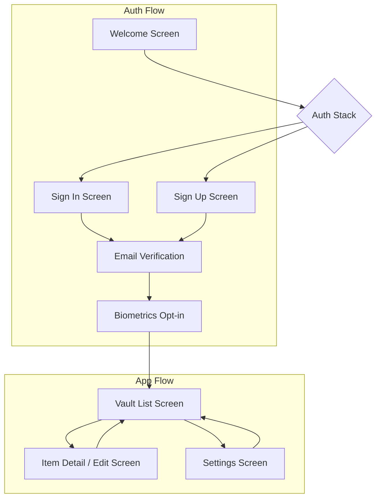
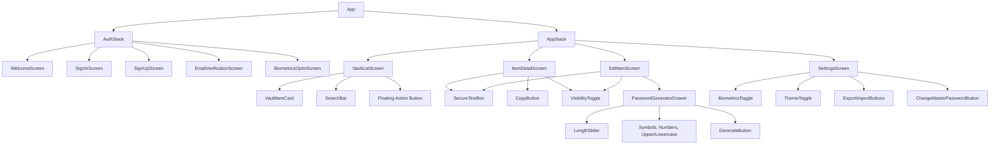

# PassBox Mobile Application Development Plan

## 1. Project Initialization & Structure

We will initialize an Expo project with TypeScript and set up a well-structured directory for maintainability and scalability.

*   **Project Creation**: `npx create-expo-app PassBox --template tabs@50` (using the tabs template as a starting point for navigation structure).
*   **Core Dependencies**: Install `react-native-safe-area-context`, `react-native-screens`, `@react-navigation/native`, `@react-navigation/stack`, `@react-navigation/bottom-tabs`, `@supabase/supabase-js`, `expo-secure-store`, `expo-local-authentication`, `expo-clipboard`, `@stablelib/argon2`, `react-query`, `zod`, `@shopify/flash-list`.
*   **Directory Structure**:

    ```
    PassBox/
    ├── assets/
    ├── components/             # Reusable UI components
    ├── constants/              # App-wide constants (colors, sizes, etc.)
    ├── hooks/                  # Custom React hooks
    ├── navigation/             # React Navigation setup (AuthStack, AppStack)
    ├── screens/                # Main application screens
    ├── services/               # API calls, Supabase interactions, crypto operations
    ├── store/                  # State management (e.g., Zustand or Context API for global state)
    ├── types/                  # TypeScript type definitions
    ├── utils/                  # Utility functions (password generator, clipboard, validation)
    ├── App.tsx                 # Main app entry point
    ├── app.json                # Expo configuration
    ├── babel.config.js
    ├── tsconfig.json
    ├── .env                    # Environment variables (Supabase URL/Anon Key)
    ├── .eslintrc.js            # ESLint configuration
    ├── .prettierrc.js          # Prettier configuration
    ├── jest.config.js          # Jest configuration
    └── README.md               # Project README
    ```

## 2. Supabase Integration

*   **Supabase Project Setup**: Ensure a Supabase project is created and configured.
*   **SQL Migration**: The provided `vault_items` and `profiles` tables, along with RLS policies, will be created as a `.sql` migration file.
*   **Supabase Client**: Initialize `@supabase/supabase-js` in `services/supabase.ts` with environment variables for URL and Anon Key.
*   **Row-Level Security (RLS)**: Implement RLS policies as specified: `auth.uid() = user_id` for `vault_items`.

## 3. Authentication Flow (F-1)

*   **Supabase Auth**: Utilize Supabase's email/password authentication.
*   **Screens**:
    *   `WelcomeScreen.tsx`: Initial screen with options to Sign In or Sign Up.
    *   `SignInScreen.tsx`: Email and password input, "Forgot Password" link.
    *   `SignUpScreen.tsx`: Email, password, and password confirmation.
    *   `EmailVerificationScreen.tsx`: Instructs user to check email for verification link.
    *   `BiometricsOptInScreen.tsx`: Prompts user to enable biometric unlock after successful sign-up/sign-in.
*   **Biometric Unlock**: Integrate `expo-local-authentication` for biometric/device credential unlock. Store a flag in `Expo SecureStore` indicating biometric preference.
*   **Password Reset**: Implement Supabase's password reset flow.

## 4. Cryptography Implementation (F-2, F-8, Non-functional)

*   **Master Key Derivation**:
    *   Use `@stablelib/argon2` (Argon2id) to derive a 256-bit AES-GCM key from the user's master password.
    *   Parameters: `ops >= 3`, `mem >= 64 MB`.
    *   Store the derived master key material (e.g., a hash or a derived key that can be re-derived) in `Expo SecureStore` (iOS Keychain / Android Keystore) for secure persistence.
*   **End-to-End Encryption**:
    *   Use `react-native-crypto` (Polyfills) for AES-GCM encryption/decryption.
    *   Encrypt/decrypt all sensitive data (passwords, notes) on the device.
    *   Never send raw passwords to Supabase.
    *   Store `ciphertext`, `IV`, and `salt` in the `vault_items` table.
*   **Master Password Change (F-8)**: When the master password is changed, re-derive the new master key and then re-encrypt all existing `vault_items` with the new key.

## 5. Vault Management (CRUD) (F-4)

*   **Data Model**: Each `vault_item` will have `id`, `title`, `username`, `encryptedPassword`, `url`, `notes`, `createdAt`, `updatedAt`.
*   **Screens**:
    *   `VaultListScreen.tsx`: Displays a list of vault items using `FlashList` for performance. Includes search bar and "Add Item" FAB.
    *   `ItemDetailScreen.tsx`: Displays details of a selected vault item.
    *   `EditItemScreen.tsx`: Allows editing existing vault items or creating new ones. Secure text boxes with visibility toggle.
*   **CRUD Operations**: Implement functions in `services/vault.ts` for interacting with Supabase to create, read, update, and delete `vault_items`.
*   **Search & Sort (F-5)**:
    *   Client-side search (debounced) across `title`, `username`, and `url`.
    *   Sort by `title` or `updatedAt`.
*   **Copy to Clipboard (F-6)**:
    *   Buttons beside username and password fields.
    *   Use `expo-clipboard`.
    *   Clear clipboard after 30 seconds.
    *   Provide haptic feedback and toast notification on copy.

## 6. Password Generator (F-3)

*   **Implementation**: A utility function in `utils/passwordGenerator.ts`.
*   **Options**: Length (8-64), include symbols, numbers, upper/lowercase.
*   **RNG**: Use `expo-crypto` for cryptographically secure random number generation.
*   **Integration**: A drawer or modal within the `EditItemScreen` to access the generator.

## 7. Offline First & Caching (F-7)

*   **Local Storage**: Use `Expo SQLite` or `MMKV` (prefer MMKV for performance and ease of use with React Native).
*   **Synchronization**: Implement a strategy to cache encrypted vault items locally and synchronize with Supabase when online. This will involve:
    *   Storing a `last_synced_at` timestamp.
    *   Queuing offline changes to be pushed to Supabase when connectivity is restored.
    *   Fetching new/updated items from Supabase and updating local cache.

## 8. Settings & Utilities (F-8)

*   **SettingsScreen.tsx**:
    *   Biometrics toggle.
    *   Change master password flow (re-encrypts all items).
    *   Theme toggle (light/dark).
    *   Export encrypted backup (.json).
    *   Import encrypted backup (.json).

## 9. Testing Strategy

*   **Unit Tests**:
    *   `Jest` + `React-Native-Testing-Library`.
    *   Focus on individual components, utility functions (e.g., password generator, crypto functions), and custom hooks.
    *   Aim for ≥ 80% coverage.
*   **End-to-End (e2e) Tests**:
    *   `Detox`.
    *   Cover key user flows: Sign up/in, creating/editing vault items, searching, copying, changing master password.

## 10. CI/CD Pipeline (GitHub Actions)

*   **Workflows**:
    *   `lint.yml`: Runs ESLint and TypeScript strict mode checks.
    *   `test.yml`: Runs Jest unit tests.
    *   `build.yml`: Builds iOS and Android apps (Expo build).
    *   `deploy.yml`: Uploads builds to App Center (or other distribution platform).
*   **Dependency Hygiene**: Include `npm audit` and `supabase db diff` checks in CI.

## 11. Security Considerations

*   **Zero-knowledge architecture**: Server stores only ciphertext; decryption keys stay on the device.
*   **Secure storage**: Master-key material persisted in `Expo SecureStore`.
*   **Rate limiting & MFA hooks**: Leverage Supabase Edge Functions for additional security layers.
*   **Static analysis**: ESLint, TypeScript strict mode, React Native Security-Code-Scan.
*   **No plaintext secrets**: Ensure no sensitive data is ever stored or transmitted in plaintext.
*   **Strong RNG**: Use `expo-crypto` for all random number generation.
*   **Certificate pinning**: Investigate and implement if necessary for production builds (Expo might handle some aspects).

## 12. Mermaid Diagrams

#### Wireframe (High-Level)



#### Component Tree (Key Components)



#### Navigation Diagram

```mermaid
graph TD
    AuthStack -- Initial Route --> WelcomeScreen
    WelcomeScreen -- Sign In --> SignInScreen
    WelcomeScreen -- Sign Up --> SignUpScreen
    SignInScreen -- Success --> BiometricsOptInScreen
    SignUpScreen -- Success --> EmailVerificationScreen
    EmailVerificationScreen -- Verified --> BiometricsOptInScreen
    BiometricsOptInScreen -- Opt-in/Skip --> AppStack

    AppStack -- Initial Route --> VaultListScreen
    VaultListScreen -- Add Item --> EditItemScreen(New Item)
    VaultListScreen -- Select Item --> ItemDetailScreen
    VaultListScreen -- Settings --> SettingsScreen

    ItemDetailScreen -- Edit --> EditItemScreen(Existing Item)
    EditItemScreen -- Save --> VaultListScreen
    SettingsScreen -- Back --> VaultListScreen